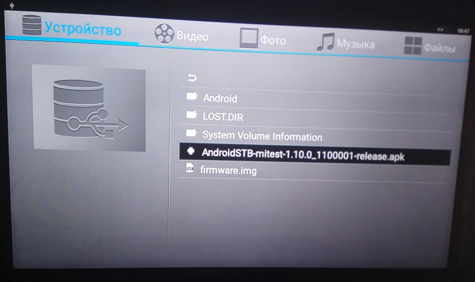
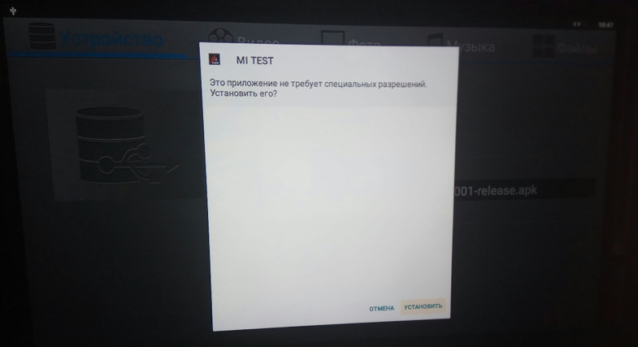
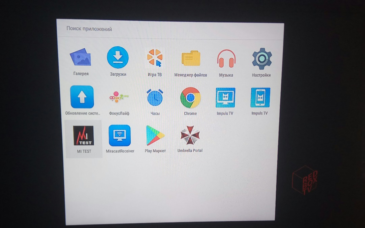
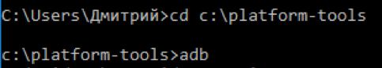
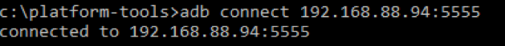
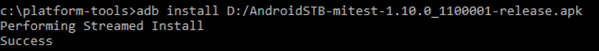

.. _androidstb:

************************************************************************
Установка приложений на телевизоры и Set-Top Box под управлением Android
************************************************************************

.. image:: androidstb/logo.png

С помощью USB-накопителя
========================

1.	Скопировать .apk на USB-накопитель.

2.	Открыть USB-накопитель и найти нужный файл:

3.	Установить приложение:

.. note::
    Возможно, потребуется включить разрешение на установку из неизвестных источников.

4.	Установленное приложение помещается в папку «Приложения»:

С помощью ADB
=============

1.	Необходимо установить SDK Platform Tools.

2.	Через командную строку запустить adb

3.	Далее необходимо подключиться к нужному устройству

4.	Установка приложения осуществляется командой adb install <путь к файлу>:

5.	Установка произойдёт в фоновом режиме, приложение отобразится в папке «Приложения»:

