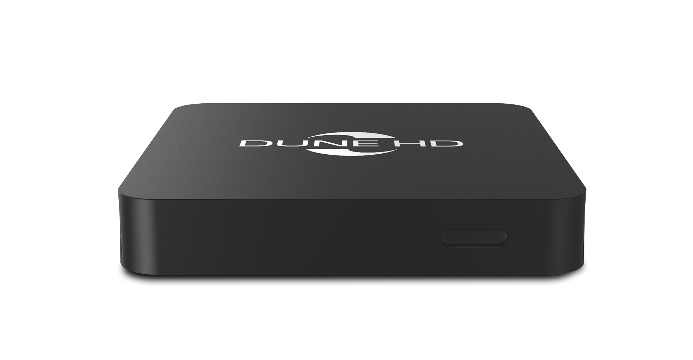
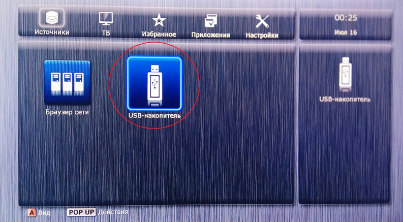
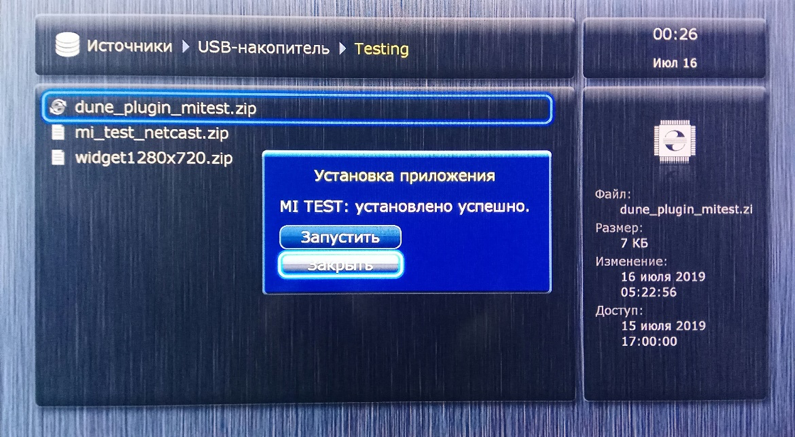
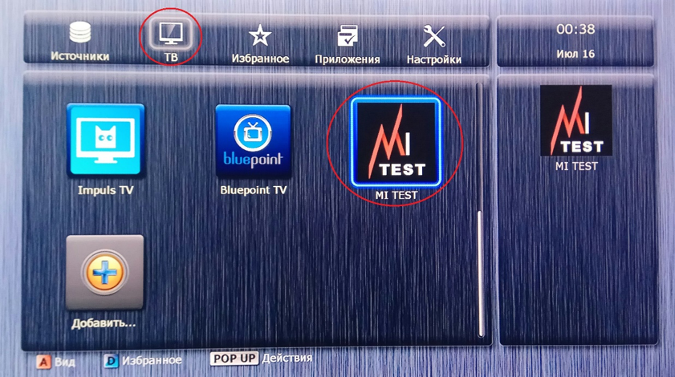

.. _dune:

*****************************************
Установка виджетов на Set-Top Box Dune HD
*****************************************

Для приставок Dune HD TV-102
============================

1.	Скопировать архив с именем dune_plugin_<название_без_кавычек>.zip на USB-накопитель.

2.	Установить USB-накопитель.

3.	Открыть USB-накопитель.

4.	Найти необходимое приложение и запустить.

5.	Установленное приложение можно найти во вкладке «ТВ»:

Для приставок Dune HD Neo, Dune HD Pro и других моделей под управлением Android
===============================================================================

Инструкция аналогична установке приложений на другие приставки под управлением Android.
