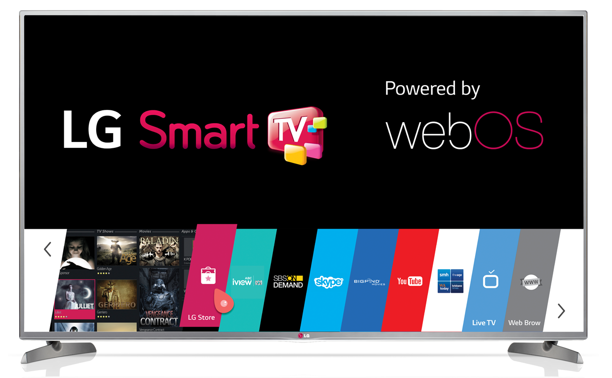
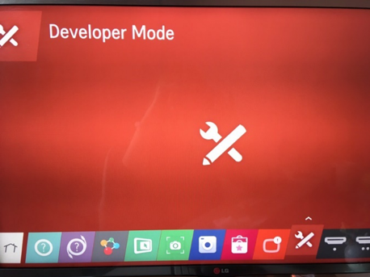
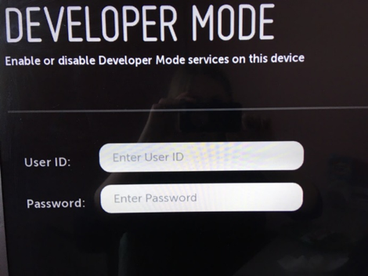
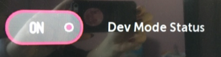
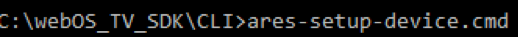
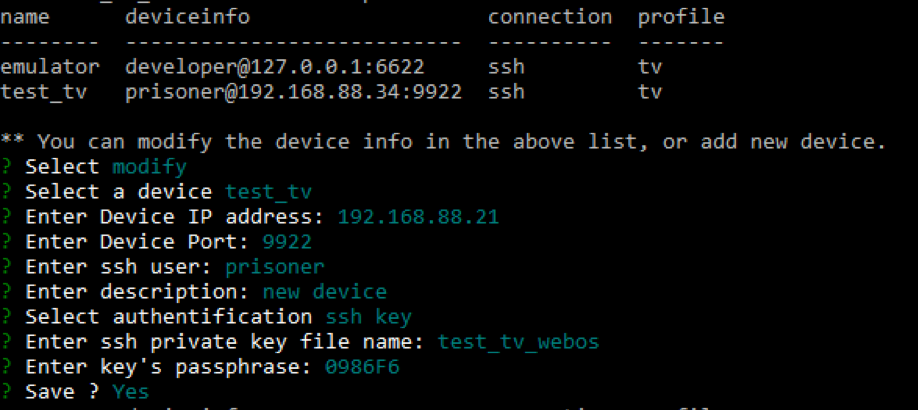
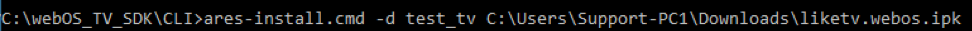
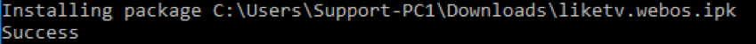

.. _lg:

********************************************
Установка виджетов на телевизоры LG Smart TV
********************************************

Для телевизоров LG Webos
========================

1. Регистрация в портале разработчика.

Для начала работы необходимо зарегистрироваться на портале разработчика: http://webostv.developer.lge.com/
Запомнить логин/пароль, он пригодится далее.
Также необходимо скачать и установить webOS TV SDK по ссылке:   http://webostv.developer.lge.com/sdk/installation/

2. Включение режима разработчика и связь ПК с ТВ.

Зайти в Developer Mode:

Ввести логин/пароль из шага 1:

Поставить переключатель в положение «ON» и перезагрузить телевизор:

Чтобы установить связь между ПК и ТВ, необходимо запустить WebOS TV CLI и ввести следующую команду:

Далее установить необходимые поля, как на рисунке ниже:

IP адрес и Passphrase находятся в Developer mode на тестовом телевизоре.
После всех выполненных манипуляций необходимо перезагрузить телевизор.

3. Установка виджета.

Необходимо запустить WebOS TV CLI и ввести следующую команду:

Где test_tv – имя телевизора, далее – полный путь до виджета.

Если все сделано верно, установка завершится успешно и в телевизоре появится установленный виджет.

4. Сброс кэша.

Для сброса кэша необходимо зайти в Developer mode и в поле «Clear Cache Data» поставить переключатель на положение «ON»:

.. image:: lg/8.png

После этого следует выключить телевизор из розетки и снова включить.

