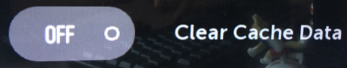
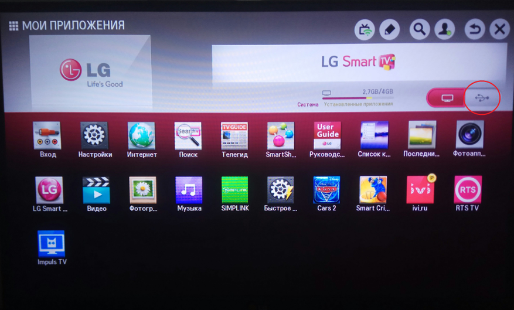
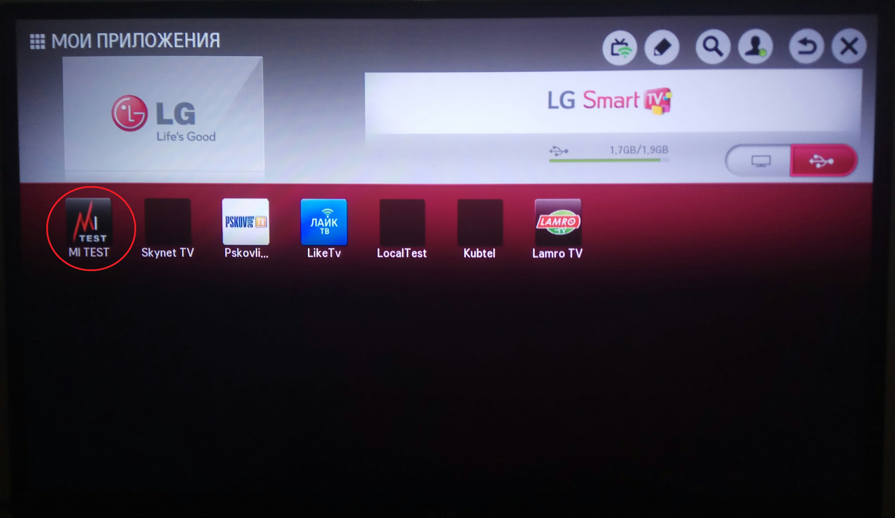

.. _lg:

********************************************
Установка виджетов на телевизоры LG Smart TV
********************************************

Для телевизоров LG Webos
========================

1. Регистрация в портале разработчика.

Для начала работы необходимо зарегистрироваться на портале разработчика: http://webostv.developer.lge.com/
Запомнить логин/пароль, он пригодится далее.
Также необходимо скачать и установить webOS TV SDK по ссылке:   http://webostv.developer.lge.com/sdk/installation/

2. Включение режима разработчика и связь ПК с ТВ.

Зайти в Developer Mode:

Ввести логин/пароль из шага 1:

Поставить переключатель в положение «ON» и перезагрузить телевизор:

Также необходимо включить keyserver.
Чтобы установить связь между ПК и ТВ, необходимо запустить WebOS TV CLI и ввести следующую команду:

``ares-novacom --device <имя_устройства> --getkey``

Во время выполнения попросит ввести passphrase с экрана телевизора.

Далее нужно ввести команду:

Далее установить необходимые поля, как на рисунке ниже:

IP адрес и Passphrase находятся в Developer mode на тестовом телевизоре.
После всех выполненных манипуляций необходимо перезагрузить телевизор.

3. Установка виджета.

Для установки виджета необходимо:
Запустить WebOS TV CLI и ввести следующую команду:

Где test_tv – имя телевизора, далее – полный путь до виджета.

Если все сделано верно, установка завершится успешно, а в телевизоре появится установленный виджет.

4. Сброс кэша.

Для сброса кэша необходимо зайти в Developer mode и в поле «Clear Cache Data» поставить переключатель на положение «ON»:

После этого следует выключить телевизор из розетки и снова включить.

Для телевизоров LG Netcast
==========================

1.	Распаковать архив в папку /lgapps/installed на USB-накопитель.

2.	Установить USB-накопитель при выключенном ТВ.

3.	Войти в «Мои приложения» и переключиться на отображение с USB-накопителя.

4.	Приложение должно отобразиться.

.. note::

    Для запуска приложений со сменных носителей может потребоваться авторизация телевизора в пользовательском аккаунте LG.
