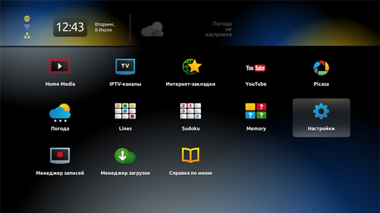
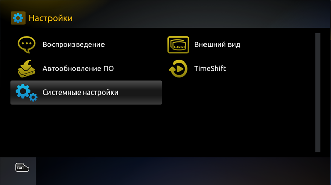
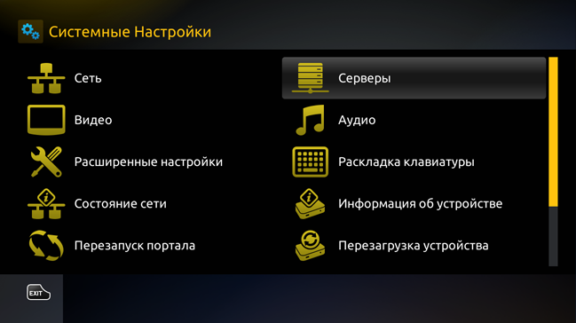
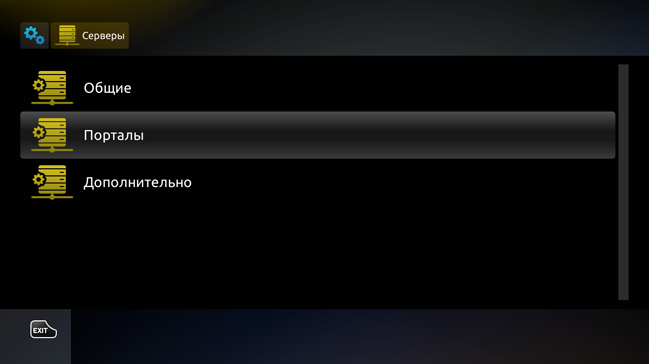
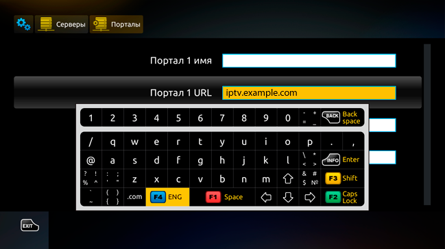
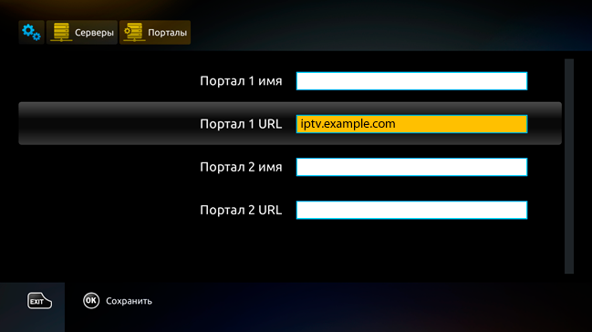
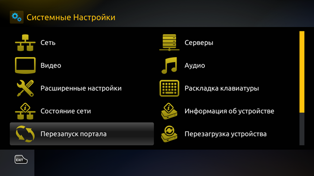

.. _mag2xx:

**********************************************************
Настройка портала для устройств MAG-2XX, Aura HD (Infomir)
**********************************************************

Для приставок с версией прошивки 0.2.18 и выше
==============================================

1. Находясь во внутреннем портале приставки выбираем пункт *Настройки*.

2. Выбираем пункт *Системные настройки*.

3. Далее выбираем *Серверы*.

4. Затем выбираем *Порталы*.

5. В строке ``Портал 1 URL`` вписываем адрес портала IPTV, например: **iptv.example.com**.

Ввод производится при помощи виртуальной клавиатуры на пульте ДУ (вызов клавиатуры – кнопка ``КВ`` на пульте).
Перемещаться между ячейками ввода можно при помощи стрелок вниз/вверх на пульте ДУ.

6. После того, как адрес портала будет прописан, нажимаем кнопку ``ОК`` для сохранения адреса. Затем нажимаем кнопку ``EXIT`` и возвращаемся в раздел *Системные настройки*.

7. Перезагружаем портал, выбрав соответствующий пункт в меню.

8. После перезагрузки откроется окно авторизации сервиса IPTV.

Для приставок версией прошивки ниже 0.2.18
==========================================

1. Находясь во внутреннем портале приставки нажимаем на пульте ДУ кнопку ``SET`` или ``SETUP`` (на некоторых моделях значок шестеренки).

2. Выбираем вкладку *Серверы*.

3. В строку ``Портал 1 URL`` вписываем адрес портала: **iptv.example.com**.

4. Ввод производится при помощи виртуальной клавиатуры на пульте ДУ. Перемещаться между ячейками ввода можно при помощи стрелок вниз/вверх на пульте ДУ.

5. После того, как все необходимые строки будут заполнены, опускаемся ниже на кнопку ``ОК`` и нажимаем ее. Затем можем перезагрузить приставку выбрав соответствующий пункт в меню.

