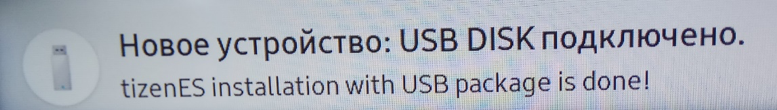

.. _samsung:

*************************************************
Установка виджетов на телевизоры Samsung Smart TV
*************************************************

Для телевизоров Samsung Orsay
=============================

1.	Поместить файл виджета <имя виджета>.zip в папку «userwidget» на USB-накопитель. Иногда требуется разархивировать файл виджета.

2.	Установить USB-накопитель при выключенном ТВ.

3. Включить телевизор.

4.	Войти в Smart Hub.

5.	Войти в «SAMSUNG APPS», нажать на круговые стрелки:

.. image:: samsung/1.png

6.	В «МОИ APP» в конце списка должен появиться устанавливаемый виджет:

.. note::
    В Samsung B и C (2009, 2010г.) установленные программы с пометкой «user» во время установки новой программы с флешки будут удалены.

.. note::
    Данный способ установки подходит не для всех моделей Samsung Orsay.

Для телевизоров Samsung Tizen
=============================

Создание tmg-файла
++++++++++++++++++

1. Войти в свой личный кабинет на сайте https://seller.samsungapps.com/tv

2. Найти кнопку "USB Demo Packaging Tool":

3. Загрузить .wgt-файл:

4. Загруженный .wgt конвертируется в два файла: .tmg-файл и файл лицензии. Данные файлы необходимо скачать для выполнения
установки приложения.

Установка приложения через USB-накопитель
+++++++++++++++++++++++++++++++++++++++++

1. На USB-накопителе создать папку userwidget.

2. Поместить в папку userwidget файлы <название виджета>.tmg и widget.license.

3. Вставить USB-накопитель в телевизор. Установка начнётся автоматически.

4. Установленное приложение появится в папке «Установленные приложения».

